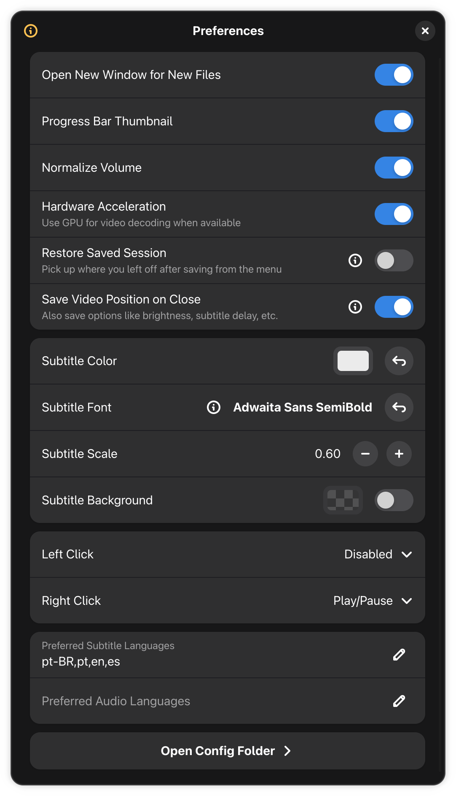
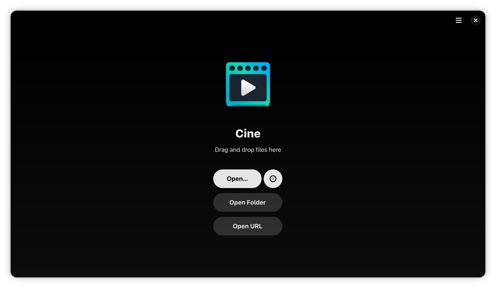

### Cine

Play your videos

<br>

<a href='https://flathub.org/apps/io.github.rusmikev.CineHDR'></a>

---

### 📢 CineHDR: AI-Enhanced HDR Fork

> [!IMPORTANT]
> **Disclaimer:** This repository is an independent fork of the original [Cine](https://github.com/diegopvlk/Cine) video player. 
> The HDR implementation and UI modifications were co-developed with **Google Gemini (Advanced Agentic Coding AI)**. 
> This software is provided **"as is"**, without warranty of any kind, express or implied. Use at your own risk.
>
> **Дисклеймер:** Этот репозиторий является независимым форком оригинального видеоплеера [Cine](https://github.com/diegopvlk/Cine).
> Поддержка HDR и изменения в интерфейсе разработаны совместно с **Google Gemini (Advanced Agentic Coding AI)**.
> Программное обеспечение предоставляется **"как есть" (as is)**, без каких-либо явных или подразумеваемых гарантий.

**Changes in this fork / Изменения в этом форке:**
* Replaced standard `GtkGLArea` with a custom high-precision float rendering pipeline (`GL_RGBA16F`).
* Integrated Wayland HDR color state signaling (`rec2100-pq` / `srgb` textures) via GTK4 ColorState APIs.
* Added a dedicated **HDR Settings** control icon on the playback panel (visible when playing HDR content) for real-time SDR/HDR switching and peak/gamut adjustment.
* Decoupled D-Bus naming flags (`NON_UNIQUE`) to allow running alongside the official Flatpak build.
* Provided system integration launcher (**CineHDR**).

---

### Description

Cine combines a clean interface with a high-performance engine to deliver a seamless viewing experience.

### Features

- **Simple Design** — A refined, distraction-free interface
- **MPV-Based** — Leverages the robust power of MPV for great playback and format support
- **Audio and Subtitles** — Control track selection and synchronization for both
- **Video Controls** — Easily adjust brightness, contrast, zoom, aspect ratio, etc.

### Screenshot

<p align="center"></p>

<div>
  <details>
    <summary>More Screenshots (Expand):</summary><br>
      <p align="center"></p>
      <p align="center"></p>
      <p align="center"></p>
  </details>
</div>

### Donate

If you want to help with a donation (thank you!), you can use:

- [PayPal](https://www.paypal.com/donate?hosted_button_id=DVL7H35GA66X6)
- [Ko-fi](https://ko-fi.com/diegopvlk)
- Pix: diego.pvlk@gmail.com

### Translations

You can help translate using [Weblate](https://hosted.weblate.org/projects/cine/app/)

[](https://hosted.weblate.org/engage/cine/)


### Code of Conduct

This project follows the [GNOME Code of Conduct](https://conduct.gnome.org).

### Installation / Установка

For general users, the easiest way to install **CineHDR** is using Flatpak:

#### Option A: Pre-built Flatpak (Fastest) / Готовая сборка Flatpak
1. Go to the [Actions](https://github.com/rusmikev/CineHDR/actions) tab of this repository.
2. Click on the latest workflow run (e.g. "Implement HDR playback support...").
3. Scroll down to the **Artifacts** section at the bottom and download `CineHDR-Flatpak-x86_64` (for standard PCs) or `CineHDR-Flatpak-aarch64` (for ARM devices).
4. Unzip the downloaded file to obtain `Cine.flatpak`.
5. Install it by running the following command in your terminal:
   ```bash
   flatpak install --user Cine.flatpak
   ```

#### Option B: Build Flatpak from source / Сборка Flatpak из исходников
If you want to compile the Flatpak bundle yourself:
1. Ensure `flatpak` and `flatpak-builder` are installed on your system.
2. Add the Flathub repository (required for runtime dependencies):
   ```bash
   flatpak remote-add --user --if-not-exists flathub https://dl.flathub.org/repo/flathub.flatpakrepo
   ```
3. Build and install the application:
   ```bash
   flatpak-builder --user --install --force-clean build-dir build-aux/flatpak/io.github.rusmikev.CineHDR.json
   ```

#### Option C: Native compilation / Локальная сборка
1. Install development dependencies (`meson`, `ninja`, `python3-mpv`, and dependencies for GTK4/Adwaita).
2. Clone the repo, open it in GNOME Builder and press run, or compile it manually using:
   ```bash
   meson setup build
   meson compile -C build
   ```
