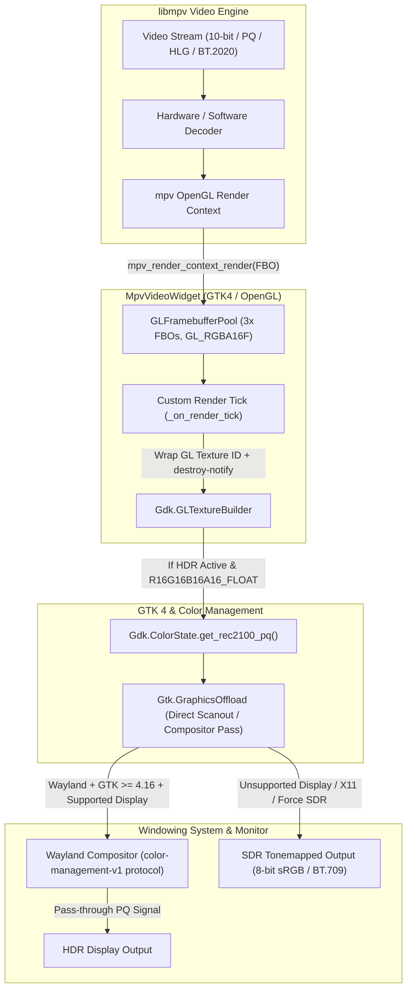
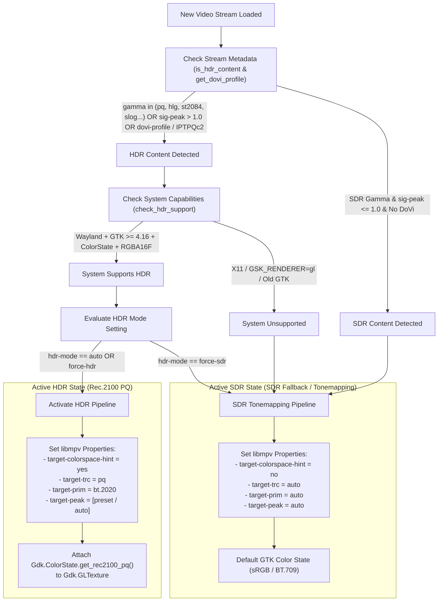

# CineHDR Rendering & Color Management Pipeline

This document details the architecture, signal flow, and color management invariants of the HDR playback pipeline implemented in **CineHDR**.

---

## 1. High-Level Architecture Flow

The following Mermaid diagram illustrates the end-to-end rendering pipeline from the video stream decoding in `libmpv` down to the hardware monitor output via the Wayland compositor and GTK4.

---

## 2. Signal Detection & Mode Decision Pipeline

How **CineHDR** dynamically decides between high-precision Rec.2100 PQ pass-through and automatic SDR tonemapping when a new video stream is loaded (`video-params` observer).

---

## 3. Core Invariants & Architectural Rules

### A. The Primaries Lock Invariant (`target-prim = bt.2020`)
When HDR rendering is active, `HdrController.apply_hdr_settings()` unconditionally locks `target-prim = "bt.2020"` in `libmpv`.
* **Rationale:** The texture passed to GTK is tagged with `Gdk.ColorState.get_rec2100_pq()`. By ITU-R Rec. 2100 definition, this color state strictly uses **BT.2020 color primaries** combined with the **PQ (ST.2084) transfer function**.
* **Why no Gamut dropdown?** If user-facing controls forced `libmpv` to render DCI-P3 or sRGB coordinates into a texture labeled as Rec.2100 PQ, the GTK color management engine and Wayland compositor would misinterpret those DCI-P3 coordinates as BT.2020 values, causing severe color shifts and desaturation.

### B. Dolby Vision Handling (`Profile 5 / 7 / 8`)
* **Profile 7 & 8 (HDR10 Base Layer + RPU):** Handled transparently via Rec.2100 PQ base layer decoding and RPU metadata parsing inside `libmpv` / `libplacebo`.
* **Profile 5 (`IPTPQc2` Proprietary Color Space):** Shaders inside `libmpv` (`vo=libmpv`) automatically reshape the `IPTPQc2` color matrix into floating-point `BT.2020 + PQ` coordinates before rendering into our `GL_RGBA16F` FBO.
* **Metadata Detection:** `get_dovi_profile()` inspects `dovi-profile`, `colormatrix`, and `primaries` properties to ensure all Dolby Vision streams (even those missing explicit `sig-peak` tags) correctly trigger `is_hdr_content = True` and report their profile in `HDR Diagnostics`.

### C. Peak Computation Strategy (`hdr-compute-peak = auto`)
CineHDR leaves `hdr-compute-peak` set to `libmpv`'s default (`auto`).
* **Tone Mapping Active (Numeric `target-peak` e.g., 400 nits):** `libmpv` automatically enables dynamic per-frame peak luminance detection on the GPU to cleanly compress highlights.
* **Pass-through Active (`target-peak = auto`):** `libmpv` automatically bypasses the GPU peak computation pass, saving video memory bandwidth and GPU power during direct pass-through.

### D. Framebuffer Pool & VRAM Lifecycle (`GLFramebufferPool`)
* **Slot Rotation:** `MpvVideoWidget` maintains a pool of 3 OpenGL Framebuffer Objects (`FBOs`) backed by high-precision `GL_RGBA16F` textures.
* **Fallback Release Timing:** When `destroy-notify` is unavailable on `Gdk.GLTextureBuilder`, the widget safely holds the *previous* fallback slot until after the *new* texture is published (`self.current_texture`). This guarantees `libmpv` never renders into a buffer actively being scanned out by the compositor, preventing tearing.
* **VRAM Retention:** `clear_frame()` drops the GTK texture wrapper when playback stops, but the OpenGL FBO pool retains its allocated buffers for instantaneous reuse until the widget is unrealized (`unrealize`).

---

## 4. Troubleshooting & Diagnostics Mapping

| Diagnostics Row | Meaning | Common Fallback Causes |
| :--- | :--- | :--- |
| **HDR Content** | Whether the video stream contains HDR metadata (`sig-peak > 1.0`, `gamma in (pq, hlg, st2084)`, or Dolby Vision profile). | Playing standard 8-bit or 10-bit SDR WCG video without PQ/HLG gamma. |
| **Dolby Vision Profile** | Which Dolby Vision profile/layer is detected (e.g. `Profile 5 (IPTPQc2 -> Rec.2100 PQ)`, `Profile 7`, `Profile 8`). | Standard HDR10 or HLG streams report `No (Standard HDR10 / HLG)`. |
| **Display HDR (Rec.2100 PQ)** | Whether GTK accepts the 16-bit float Rec.2100 PQ color state on the active display. | Running under X11, `GSK_RENDERER=gl`, or GTK version older than `4.16`. |
| **System HDR Limitation** | Specific reason why the system cannot establish a direct HDR pass-through path. | Compositor lacks `color-management-v1` protocol, or X11 windowing system is in use. |
