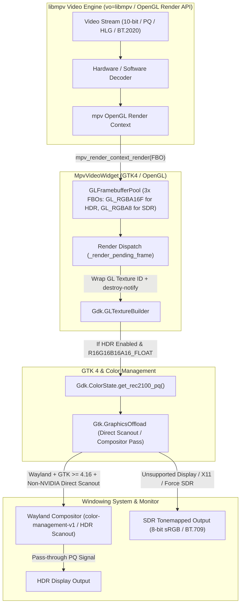
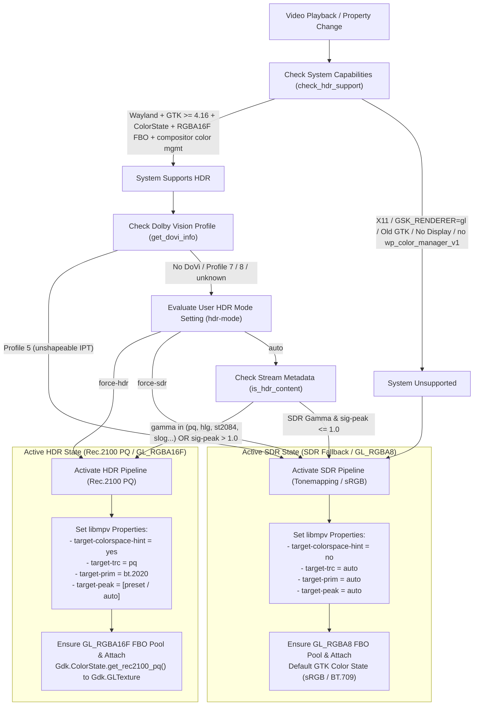

# CineHDR Rendering & Color Management Pipeline

This document details the architecture, signal flow, and color management invariants of the HDR playback pipeline implemented in **CineHDR**.

---

## 1. High-Level Architecture Flow

The following Mermaid diagram illustrates the end-to-end rendering pipeline from the video stream decoding in `libmpv` down to the hardware monitor output via the Wayland compositor and GTK4.

---

## 2. Signal Detection & Mode Decision Pipeline

How **CineHDR** dynamically evaluates system capabilities (`check_hdr_support`), user settings (`hdr-mode`), and stream metadata (`is_hdr_content`) when deciding between Rec.2100 PQ pass-through and SDR tonemapping (`update_hdr_state`).

---

## 3. Core Invariants & Architectural Rules

### A. The Primaries Lock Invariant (`target-prim = bt.2020`)
When HDR rendering is active (`hdr_enabled == True`), `HdrController.apply_hdr_settings()` unconditionally locks `target-prim = "bt.2020"` in `libmpv`.
* **Rationale:** The texture passed to GTK is tagged with `Gdk.ColorState.get_rec2100_pq()`. By ITU-R Rec. 2100 definition, this color state strictly uses **BT.2020 color primaries** combined with the **PQ (ST.2084) transfer function**.
* **Why no Gamut dropdown?** If user-facing controls forced `libmpv` to render DCI-P3 or sRGB coordinates into a texture labeled as Rec.2100 PQ, the GTK color management engine and Wayland compositor would misinterpret those DCI-P3 coordinates as BT.2020 values, causing severe color shifts and desaturation.

### B. Dolby Vision Capabilities & Limitations under `vo=libmpv`
* **Architectural Reality:** CineHDR delegates OpenGL rendering to `mpv`'s render API (`vo=libmpv` backed by `video/out/gpu/video.c`). Under this legacy OpenGL renderer, active Dolby Vision RPU metadata processing (`libplacebo/utils/dolbyvision.h`, `repr.dovi`) is not supported (`mp_image_params_restore_dovi_mapping()` restores pre-DV signaling). Full RPU processing requires the `vo=gpu-next` backend, which is not yet accessible via the standard `libmpv/render` OpenGL API (`MPV_RENDER_PARAM_BACKEND` / PR #16818).
* **Profile 7 & 8 (`HDR10 Base Layer + RPU`):** Because the base video stream is standard 10-bit Rec.2020 PQ (`gamma="pq"`, `sig-peak > 1.0`), `is_hdr_content()` detects the base layer and activates normal Rec.2100 PQ pass-through. The RPU dynamic enhancement layer is bypassed (`RPU not processed`).
* **Profile 5 (`IPTPQc2` Proprietary Color Space):** Attaching a `Rec.2100 PQ` color state to unshaped Profile 5 IPT frames yields false colors (green/purple tint) *and* flips the monitor into HDR mode. Note that content detection alone cannot prevent this: libplacebo's `pl_map_avdovi_metadata()` rewrites the decoder-side frame parameters to `primaries=bt.2020` / `transfer=pq` for every single-layer DoVi stream, so `video-params` reports `gamma="pq"` and `is_hdr_content()` returns `True` for Profile 5 as well. The refusal therefore lives in `HdrController.is_hdr_active`, as a **capability gate placed ahead of the user's `hdr-mode`** (`DOVI_UNSUPPORTED_PROFILES = (5,)`): Profile 5 always falls back to `mpv`'s SDR tone mapping, and even `force-hdr` cannot override it, because forcing HDR cannot repair the picture — it only adds a wrong mode switch on top of wrong colors. A one-shot warning is logged (`check_dovi_warning()`).
* **Profile Source:** `get_dovi_info()` reads the profile from the *track* properties (`current-tracks/video/dolby-vision-profile` / `dolby-vision-level`) — the only reliable source, since `video-params` never carries it. The `colormatrix == "dolbyvision"` fingerprint is used as a **presence** signal only: libplacebo sets it identically for Profiles 5 and 8, so it cannot tell them apart. When the profile cannot be read, the stream is reported as *detected, profile unknown* and the pipeline is left untouched — refusing HDR on a guess would needlessly downgrade a perfectly playable Profile 8 stream.

### C. Peak Computation Strategy (`hdr-compute-peak = auto`)
CineHDR leaves `hdr-compute-peak` set to `libmpv`'s default (`auto`).
* **Tone Mapping Active (Numeric `target-peak` e.g., 400 nits):** `libmpv` automatically enables dynamic per-frame peak luminance detection on the GPU to cleanly compress highlights.
* **Pass-through Active (`target-peak = auto`):** `libmpv` automatically bypasses the GPU peak computation pass, saving video memory bandwidth and GPU power during direct pass-through.

### D. Framebuffer Pool & VRAM Lifecycle (`GLFramebufferPool`)
* **Dynamic Format Allocation:** `GLFramebufferPool.ensure()` dynamically selects internal texture formats: `GL_RGBA16F` (16-bit float per channel, 64 bpp) when `hdr_enabled` is True, and `GL_RGBA8` (8-bit integer, 32 bpp) when SDR is active, cutting VRAM bandwidth by 50% during SDR playback.
* **Slot Rotation:** `MpvVideoWidget` maintains a pool of 3 OpenGL Framebuffer Objects (`FBOs`) to allow asynchronous triple-buffering.
* **Fallback Release Timing:** When `destroy-notify` is unavailable on `Gdk.GLTextureBuilder`, the widget safely holds the *previous* fallback slot (`self._fallback_slot`) until after the *new* texture is published (`self.current_texture`). This guarantees `libmpv` never renders into a buffer actively being scanned out by the compositor, preventing tearing.
* **GraphicsOffload & NVIDIA Handling:** `Window` wraps `MpvVideoWidget` inside `Gtk.GraphicsOffload`. If an NVIDIA proprietary GPU driver is detected (`get_gpu_vendor()` in `utils.py`), `GraphicsOffload` is disabled (`DISABLED`) to prevent Wayland cursor flickering and buffer sync artifacts, while remaining enabled (`ENABLED`) for direct scanout on AMD and Intel GPUs.

### E. Compositor Capability Probe (`wayland_cm_probe.py`)
`check_hdr_support()` used to trust proxy signals only (Wayland session, GTK API presence, dmabuf formats). None of those prove the *compositor* can accept a Rec.2100 PQ surface: on a Wayland compositor without color management GTK silently converts PQ -> sRGB with a plain colorimetric transform, which looks *worse* than mpv's tone mapping — the exact "washed out unless you pick Force SDR" failure mode described in the README.
* **Mechanism:** a private `wl_event_queue` + proxy wrapper is attached to GTK's own `wl_display` (the documented libwayland pattern for sharing a connection with a toolkit), the registry globals are enumerated in one round-trip, and the result is reduced to a tri-state:
  * `True` — `wp_color_manager_v1` (ratified protocol; KWin / Plasma 6.3+, Mutter / GNOME 48+) or `xx_color_manager_v4` (experimental predecessor spoken by GTK 4.16/4.17) is advertised.
  * `False` — registry enumerated, no color-management global: HDR pass-through is refused and mpv tone mapping is used, regardless of `hdr-mode`.
  * `None` — the probe could not run (no Wayland display, libwayland unavailable): **behaviour is unchanged** relative to previous releases; only a definitive "no" blocks HDR.
* **Caching:** the result is cached per process and dropped together with the `check_hdr_support()` cache (`invalidate_hdr_support_cache()`), i.e. on widget realize and monitor hot-plug.

### F. Niri Renderer Pin (`main.py`)
Upstream Cine pins `GSK_RENDERER=gl` globally to work around frame drops on the Niri compositor; CineHDR removed the global pin because the legacy GL renderer has no color-state support. The workaround is now applied *surgically*: when `NIRI_SOCKET` is present in the environment and the user has not set `GSK_RENDERER` themselves, the pin is restored. Niri offers no color management, so no HDR capability is lost — CineHDR detects the legacy renderer and falls back to SDR tone mapping as before.

### G. Monitor HDR State Gate (`wayland_output_hdr.py`)
The compositor capability probe (invariant E) still leaves one quality gap: a color-management-capable compositor with monitor HDR switched **off** accepts the Rec.2100 PQ surface and converts it to SDR itself — a plain colorimetric transform that looks worse than mpv's tone mapping. This module closes the gap by reading each output's *image description* through the protocol itself:
* **Mechanism:** on the same private event queue, `wp_color_manager_v1` is bound from the registry (its `supported_*` capability burst is swallowed by a no-op listener); for every `GdkMonitor`, GTK's own `wl_output` proxy (`gdk_wayland_monitor_get_wl_output()`) is passed to `get_output` -> `get_image_description` -> `get_information`, and `tf_named` / `primaries_named` / `luminances` are collected until `done`. The `wl_interface`/`wl_message` tables for the four `wp_*` interfaces are hand-built in ctypes (libwayland dispatches foreign-interface events through libffi using exactly these tables — the event rows are locked by `test_interface_tables_match_protocol`). The `icc_file` fd is closed immediately; ownership transfers with the event.
* **Classification (`classify_hdr`, pure & unit-tested):** transfer function `st2084_pq` or `hlg` -> HDR; else `max_lum > reference_lum` -> HDR; else SDR. Unknown -> SDR *for the output*, but any probe failure makes the whole answer `None` (unknown) — the tri-state discipline of invariant E applies unchanged.
* **Gate placement:** in `HdrController.is_hdr_active`, **after** `force-hdr`. A definitive "monitor is SDR" blocks *auto mode only*: unlike the DoVi P5 gate the picture is valid, so an explicit `force-hdr` is respected (the user trades mpv tone mapping for the compositor's conversion knowingly).
* **Multi-monitor:** `MpvVideoWidget` pushes the connector of the monitor it currently sits on (`Gdk.Display.get_monitor_at_surface`, re-evaluated on realize and `enter-monitor`/`leave-monitor`) into `HdrController.set_output_hint()`; without a hint, *any* HDR output keeps HDR allowed, and only "all outputs SDR" blocks.
* **Caching:** `is_hdr_active` is evaluated per rendered frame while one probe costs three compositor round-trips per output, so results are cached for `CACHE_TTL_SECONDS` (2 s) and invalidated together with the other caches. Toggling monitor HDR mid-playback is therefore picked up within ~2 s / next settings re-apply; a persistent `image_description_changed` listener integrated into the GLib main loop is the planned follow-up (docs/ROADMAP.md).

---

## 4. Troubleshooting & Diagnostics Mapping

The table below maps UI rows in the `HDR Diagnostics` dialog (`src/hdr_diagnostics.py`) to system invariants and fallbacks:

| UI Row Title | Meaning & Source | Common Fallback Causes / Notes |
| :--- | :--- | :--- |
| **HDR Status** | Shows active mode and whether video content has HDR metadata (`is_hdr_content` -> `sig-peak > 1.0` or `gamma in (pq, hlg, st2084)`). | Reports `HDR Active (Rec.2100 PQ)` during HDR pass-through, or `SDR Tonemapping` during SDR playback. |
| **Display HDR Supported** | Whether GTK accepts high-precision Rec.2100 PQ color state on the active display (`check_hdr_support()`). | Reports `No` if running under X11, `GSK_RENDERER=gl`, or GTK version older than `4.16`. |
| **Monitor HDR State** | Live output image description (`wayland_output_hdr.get_output_hdr_states()`): transfer function, primaries, peak luminance per connector. | `SDR — enable HDR in display settings` explains why auto mode is tone mapping despite full system support; multi-monitor shows which connectors are HDR. |
| **Compositor Color Management** | Direct answer from the Wayland registry (`wayland_cm_probe.probe_color_management()`): is `wp_color_manager_v1` / `xx_color_manager_v4` advertised? | `No` means HDR pass-through is physically impossible on this compositor (older wlroots, Weston without CM, Niri); `Unknown` means the probe could not run and legacy behaviour applies. |
| **Graphics Offload (Direct Scanout)** | State of the `Gtk.GraphicsOffload` wrapper around the video widget. | `Disabled (NVIDIA workaround)` on proprietary NVIDIA drivers — HDR still works through GTK compositing, but without direct scanout. |
| **Dolby Vision Profile** | Reports detected Dolby Vision metadata (`current-tracks/video/dolby-vision-profile` or colormatrix). | Reports `Profile 5 (Unsupported in vo=libmpv / RPU not processed)` or `Profile 7/8 (HDR10 Base / RPU not processed)` to transparently reflect `libmpv/render` API capabilities. |
| **System HDR Limitation** | Specific explanation when `Display HDR Supported` returns `No` (`get_hdr_unsupported_reason()`). | Indicates when X11 windowing system is in use or when the Wayland display/compositor lacks HDR capability. |
