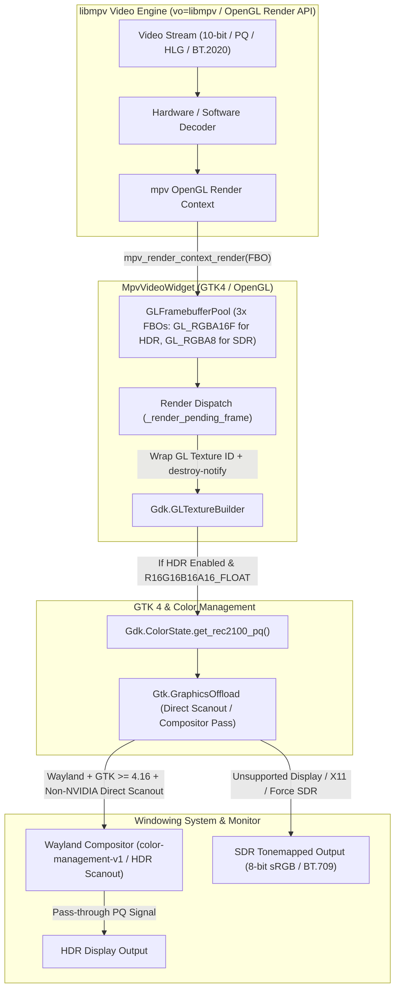
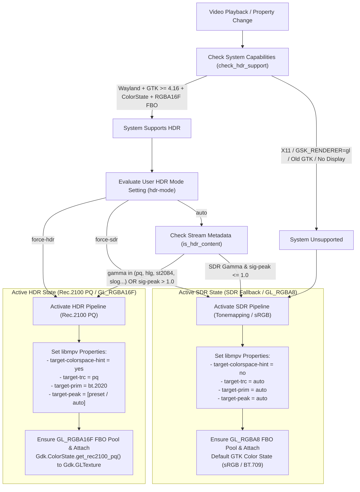

# CineHDR Rendering & Color Management Pipeline

This document details the architecture, signal flow, and color management invariants of the HDR playback pipeline implemented in **CineHDR**.

---

## 1. High-Level Architecture Flow

The following Mermaid diagram illustrates the end-to-end rendering pipeline from the video stream decoding in `libmpv` down to the hardware monitor output via the Wayland compositor and GTK4.

---

## 2. Signal Detection & Mode Decision Pipeline

How **CineHDR** dynamically evaluates system capabilities (`check_hdr_support`), user settings (`hdr-mode`), and stream metadata (`is_hdr_content`) when deciding between Rec.2100 PQ pass-through and SDR tonemapping (`update_hdr_state`).

---

## 3. Core Invariants & Architectural Rules

### A. The Primaries Lock Invariant (`target-prim = bt.2020`)
When HDR rendering is active (`hdr_enabled == True`), `HdrController.apply_hdr_settings()` unconditionally locks `target-prim = "bt.2020"` in `libmpv`.
* **Rationale:** The texture passed to GTK is tagged with `Gdk.ColorState.get_rec2100_pq()`. By ITU-R Rec. 2100 definition, this color state strictly uses **BT.2020 color primaries** combined with the **PQ (ST.2084) transfer function**.
* **Why no Gamut dropdown?** If user-facing controls forced `libmpv` to render DCI-P3 or sRGB coordinates into a texture labeled as Rec.2100 PQ, the GTK color management engine and Wayland compositor would misinterpret those DCI-P3 coordinates as BT.2020 values, causing severe color shifts and desaturation.

### B. Dolby Vision Capabilities & Limitations under `vo=libmpv`
* **Architectural Reality:** CineHDR delegates OpenGL rendering to `mpv`'s render API (`vo=libmpv` backed by `video/out/gpu/video.c`). Under this legacy OpenGL renderer, active Dolby Vision RPU metadata processing (`libplacebo/utils/dolbyvision.h`, `repr.dovi`) is not supported (`mp_image_params_restore_dovi_mapping()` restores pre-DV signaling). Full RPU processing requires the `vo=gpu-next` backend, which is not yet accessible via the standard `libmpv/render` OpenGL API (`MPV_RENDER_PARAM_BACKEND` / PR #16818).
* **Profile 7 & 8 (`HDR10 Base Layer + RPU`):** Because the base video stream is standard 10-bit Rec.2020 PQ (`gamma="pq"`, `sig-peak > 1.0`), `is_hdr_content()` detects the base layer and activates normal Rec.2100 PQ pass-through. The RPU dynamic enhancement layer is bypassed (`RPU not processed`).
* **Profile 5 (`IPTPQc2` Proprietary Color Space):** Because `vo=libmpv` cannot process Profile 5 RPU reshaping into Rec.2100 PQ, attaching a `Rec.2100 PQ` color state to unshaped Profile 5 IPT frames results in false colors (green/purple tint). Therefore, `is_hdr_content()` strictly checks `gamma` and `sig-peak` and excludes Profile 5 metadata from triggering HDR pass-through, allowing `mpv`'s tone mapping fallback to handle Profile 5 streams cleanly in SDR.
* **Diagnostics Reporting:** `get_dovi_profile()` queries `current-tracks/video/dolby-vision-profile` and `dolby-vision-level` strictly for descriptive diagnostics in `HDR Status` without falsely asserting Rec.2100 PQ color conversion.

### C. Peak Computation Strategy (`hdr-compute-peak = auto`)
CineHDR leaves `hdr-compute-peak` set to `libmpv`'s default (`auto`).
* **Tone Mapping Active (Numeric `target-peak` e.g., 400 nits):** `libmpv` automatically enables dynamic per-frame peak luminance detection on the GPU to cleanly compress highlights.
* **Pass-through Active (`target-peak = auto`):** `libmpv` automatically bypasses the GPU peak computation pass, saving video memory bandwidth and GPU power during direct pass-through.

### D. Framebuffer Pool & VRAM Lifecycle (`GLFramebufferPool`)
* **Dynamic Format Allocation:** `GLFramebufferPool.ensure()` dynamically selects internal texture formats: `GL_RGBA16F` (16-bit float per channel, 64 bpp) when `hdr_enabled` is True, and `GL_RGBA8` (8-bit integer, 32 bpp) when SDR is active, cutting VRAM bandwidth by 50% during SDR playback.
* **Slot Rotation:** `MpvVideoWidget` maintains a pool of 3 OpenGL Framebuffer Objects (`FBOs`) to allow asynchronous triple-buffering.
* **Fallback Release Timing:** When `destroy-notify` is unavailable on `Gdk.GLTextureBuilder`, the widget safely holds the *previous* fallback slot (`self._fallback_slot`) until after the *new* texture is published (`self.current_texture`). This guarantees `libmpv` never renders into a buffer actively being scanned out by the compositor, preventing tearing.
* **GraphicsOffload & NVIDIA Handling:** `MpvVideoWidget` wraps the render view inside `Gtk.GraphicsOffload`. If an NVIDIA proprietary GPU driver is detected (`check_nvidia()`), `GraphicsOffload` is disabled (`DISABLED`) to prevent Wayland cursor flickering and buffer sync artifacts, while remaining enabled (`ENABLED`) for direct scanout on AMD and Intel GPUs.

---

## 4. Troubleshooting & Diagnostics Mapping

The table below maps UI rows in the `HDR Diagnostics` dialog (`src/hdr_diagnostics.py`) to system invariants and fallbacks:

| UI Row Title | Meaning & Source | Common Fallback Causes / Notes |
| :--- | :--- | :--- |
| **HDR Status** | Shows active mode and whether video content has HDR metadata (`is_hdr_content` -> `sig-peak > 1.0` or `gamma in (pq, hlg, st2084)`). | Reports `HDR Active (Rec.2100 PQ)` during HDR pass-through, or `SDR Tonemapping` during SDR playback. |
| **Display HDR Supported** | Whether GTK accepts high-precision Rec.2100 PQ color state on the active display (`check_hdr_support()`). | Reports `No` if running under X11, `GSK_RENDERER=gl`, or GTK version older than `4.16`. |
| **Dolby Vision Profile** | Reports detected Dolby Vision metadata (`current-tracks/video/dolby-vision-profile` or colormatrix). | Reports `Profile 5 (Unsupported in vo=libmpv / RPU not processed)` or `Profile 7/8 (HDR10 Base / RPU not processed)` to transparently reflect `libmpv/render` API capabilities. |
| **System HDR Limitation** | Specific explanation when `Display HDR Supported` returns `No` (`get_hdr_unsupported_reason()`). | Indicates when X11 windowing system is in use or when the Wayland display/compositor lacks HDR capability. |
